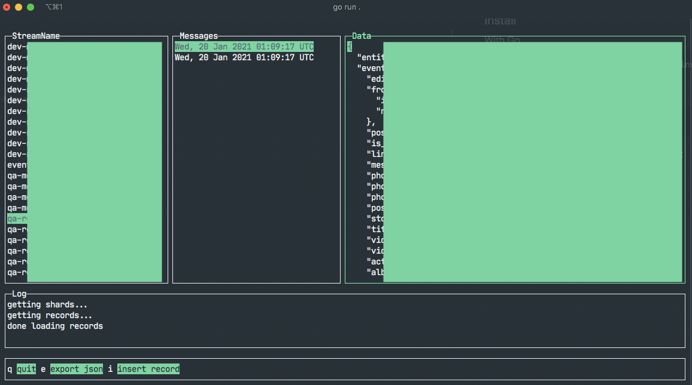

# go-kinspector

A CUI tool inspect your AWS kinesis streams, check records, and put new records.



## Build

```zsh
go build .
```

## Install

### With Go

```zsh
go get github.com/borgmon/go-kinspector
go-kinspector
```

if you cannot find the command, add your `~/go/bin` to your `PATH`

```zsh
export PATH="$PATH:$HOME/go/bin"
```

### Download binary

```zsh
./go-kinspector
```

### Requirement

config your aws key in `~/.aws`
